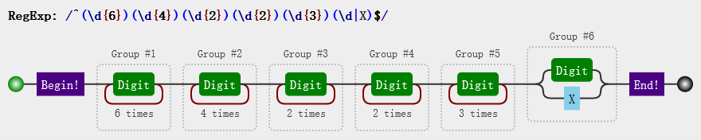
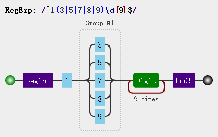
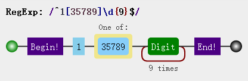
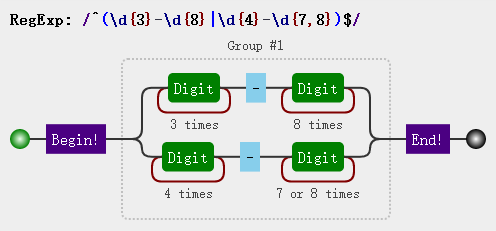

# 正则表达式的几个简单练习

偶然听到正则表达式属于某个考试的考察范围，于是怀着有点功利的心开始学习 orz。事实证明，有时候抱佛脚还是蛮管用的呢^_^ 

## 1.匹配身份证号码
首先简单分析一下身份证号码的组成及各部分的特点：

>6位地区编码(纯数字) + 8位生日（纯数字） + 3位顺序码（纯数字） + 1位校验码（纯数字、X）

```
# 6位地区编码(纯数字)
\d{6}

# 8位生日（纯数字)，4位年份 + 2位月份 + 2位日期，细致区分以便后续优化
\d{4}\d{2}\d{2}

# 3位顺序码（纯数字）
\d{3}

# 1位校验码
\d|X

# 最终完整的正则表达式
^(\d{6})(\d{4})(\d{2})(\d{2})(\d{3})(\d|X)$
```


## 2.匹配手机号
依旧是对手机好的组成进行简单分析：
> 1为首位 + （3、5、7、8、9）为第二位 + 9为数字
```
# 竖线表示两项之间的一个选择
^1(3|5|7|8|9)\d{9}$
```

```
# 由于方括号中每个字符都是元字符，所以还有另一种解法如下：
^1[35789]\d{9}$
```



## 3.匹配座机号码
对座机号码的组成进行分析：
> 3位区号 + 8位座机号， 4位区号 + 7-8位座机号
```
^(\d{3}-\d{8}|\d{4}-\d{7,8})$
```



## 4.推荐网站
1. [在线正则表达式测试](https://tool.oschina.net/regex#)
2. 可视化正则表达式网站[Regulex](https://jex.im/regulex/)